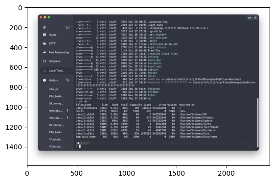
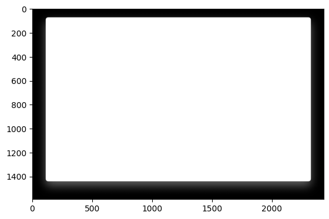
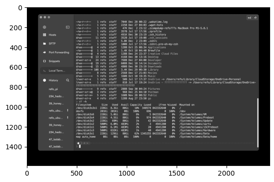
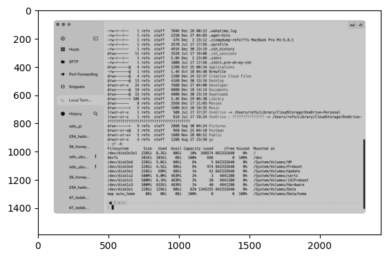
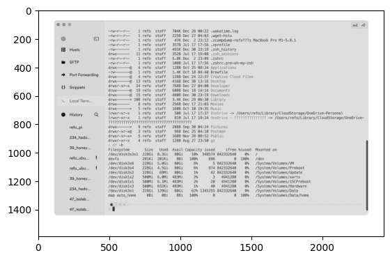
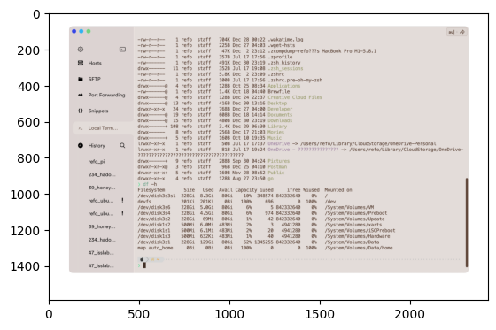
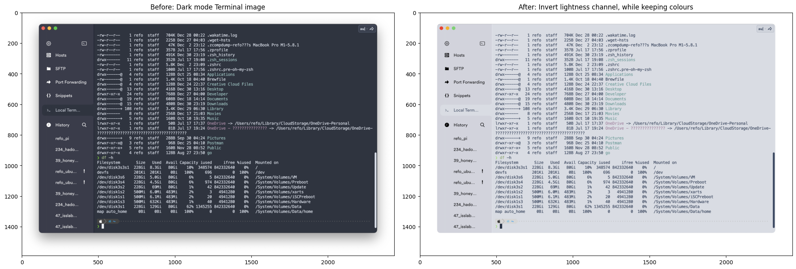

# CaptureD2L Image Processing

## Import

```python
from math import log

import cv2
import gc
import glob
import matplotlib.pyplot as plt
import numpy as np
import os
```

## Read image file

```python
input_path = './samples/Nord Dark.png'

image_bgra = cv2.imread(input_path, cv2.IMREAD_UNCHANGED)
image_rgba = cv2.cvtColor(image_bgra, cv2.COLOR_BGRA2RGBA)
plt.imshow(image_rgba)
gc.collect()
```



## preserve alpha channel

```python
alpha = image_bgra[:, :, 3]
alpha_rgb = cv2.cvtColor(alpha, cv2.COLOR_BGRA2RGBA)
plt.imshow(alpha_rgb)
gc.collect()
```



## Convert RGB to HSL

```python
# to make terminal capture image into light mode while keeping the colour data,
# invert lightness channel in hls color model
image_hls = cv2.cvtColor(image_bgra, cv2.COLOR_BGR2HLS)
h, l, s = cv2.split(image_hls)
plt.imshow(cv2.merge([l, l, l]))
gc.collect()
```



## Invert L channel

```python
l_new = 255 - l
plt.imshow(cv2.merge([l_new, l_new, l_new]))
gc.collect()
```



## Additional processing

```python
# little lighten
gamma = 1.8
l_new = captured2l.modify_gamma_channel_l(l_new, gamma)

plt.imshow(cv2.merge([l_new, l_new, l_new]))
gc.collect()
```



## HSL to RGB

```python
# merge inverted l channel to make new image
image_hls_new = cv2.merge([h, l_new, s])
image_bgra_new = cv2.cvtColor(cv2.cvtColor(image_hls_new, cv2.COLOR_HLS2BGR), cv2.COLOR_BGR2BGRA)

# revert alpha channel
image_bgra_new[:, :, 3] = alpha

plt.imshow(image_bgra_new)
gc.collect()
```



## Export result

```python
# cv2 export in bgr colour mode
out_path = input_path.replace('.png', '_d2l.png')
cv2.imwrite(out_path, image_bgra_new)
```

```python
image_rgba_new = cv2.cvtColor(image_bgra_new, cv2.COLOR_BGRA2RGBA)

fig, axes = plt.subplots(1, 2, figsize=(20, 7), constrained_layout=True)
image_rgba = cv2.cvtColor(image_bgra, cv2.COLOR_BGRA2RGBA)

axes[0].set_title("Before: Dark mode Terminal image")
axes[0].imshow(image_rgba)

axes[1].set_title("After: Invert lightness channel, while keeping colours")
axes[1].imshow(image_rgba_new)

plt.show()
plt.close(fig)
gc.collect()
```



- <https://kkokkal.tistory.com/1326>
